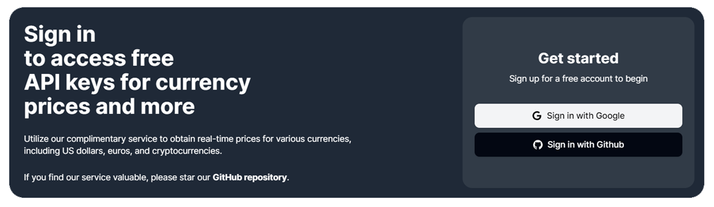
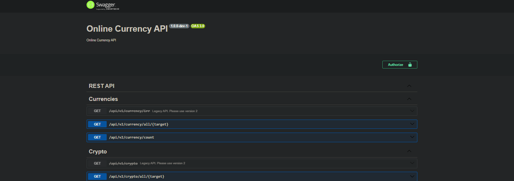
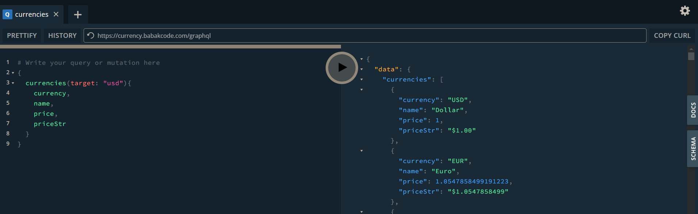

# Let’s Get Started! 🔥

### 🔑 **Getting Started: Obtain Your API Key**
Before testing the API or integrating it into your application, you need to obtain a free API key:
1. Visit **[https://babakcode.com](https://babakcode.com)**.
    

2. Sign up or log in to your account.
3. Generate a new API key from the dashboard.

Once you have your API key, you can test all available endpoints through the  [`/docs`](https://currency.babakcode.com/docs) path.

---

### 🌟 **How to Use Your API Key**
The API key must be included in the `api-key` header or in the query `?api-key=YOUR_API_KEY` for all requests. 

Example:

```http
api-key: YOUR_API_KEY
```

or 
```http
/v1/crypto?api-key=YOUR_API_KEY
```

---

### 🔍 **Explore the API with Swagger Documentation**

We provide an interactive **Swagger documentation** where you can:
1. Browse through available endpoints.
2. Test API calls directly in your browser.
3. Explore response formats and data structures.

The Swagger documentation is accessible at the [`/docs`](https://currency.babakcode.com/docs) path of the API.



---

## 🔗 **GraphQL Documentation**

The **GraphQL** integration allows you to query cryptocurrency data with precision and flexibility. 
Using GraphQL, you can fetch exactly the fields you need, reducing response size and improving efficiency.

### 📘 **Example API Query for GraphQL**

- **Query: `cryptoAll`**  
  Fetch all supported cryptocurrencies with customizable fields like `symbol`, `name`, `logo`, `price`, and `timestamp`, targeting a specific base currency (e.g., **USD**).

  ```graphql
  query {  
    cryptoAll(base: "USD") {  
      symbol,  
      logo,  
      name,  
      price,  
      priceStr,  
      timestamp  
    }  
  }
  ```

With **GraphQL**, you can build highly efficient and tailored queries for your cryptocurrency data needs. Try it out in the Swagger documentation now!

