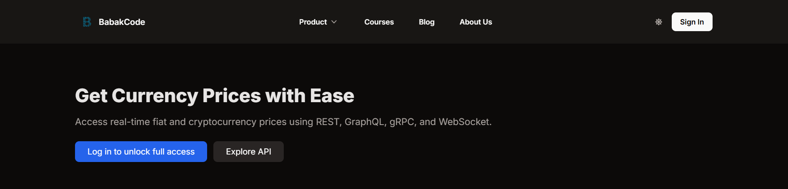
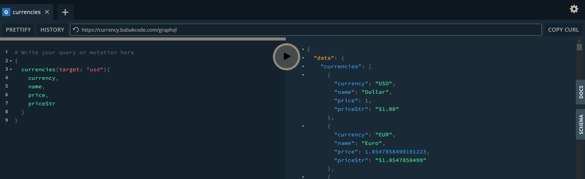

# Introduction

Welcome to Free Currency API 🌍

## Your Ultimate Solution for Free and Real-Time Currency Data

The **Free Currency API** is a robust platform that provides free access to live currency and cryptocurrency prices. Whether you're a developer building financial tools, a trader monitoring the markets, or a hobbyist exploring the world of currencies, our API has you covered.

---

### 🌟 **Why Choose Free Currency API?**

#### 🚀 **Multi-Protocol Support**
Our API supports **HTTP**, **GraphQL**, and **WebSocket**, giving you the flexibility to integrate in the way that best fits your application.

#### 💰 **Hundreds of Cryptocurrencies**
Get live prices for popular cryptocurrencies like **Bitcoin (BTC)**, **Ethereum (ETH)**, and **hundreds more**. Our API supports base currencies like **USD**, **EUR**, and others, ensuring global compatibility.

#### ⚡ **Real-Time Updates**
Stay ahead of the market with **real-time streaming** data. With WebSocket support, you can receive instant price updates as they happen, keeping your applications always up-to-date.

---

### 📖 **What Can You Do with Free Currency API?**

1. **Fetch Cryptocurrency Prices**: Easily retrieve current prices for BTC, ETH, and many other cryptocurrencies in your preferred base currency.
2. **Monitor Real-Time Changes**: Keep track of price fluctuations and trends with real-time updates.
3. **Build Advanced Applications**: Use our API to create trading bots, financial dashboards, or any tool requiring accurate currency data.

---

### 🔧 **Get Started in Minutes**

1. **Choose Your Protocol**: Decide between **HTTP**, **GraphQL**, or **WebSocket** based on your project needs.
2. **Integrate with Ease**: Follow our comprehensive documentation to connect to the API quickly.
3. **Start Fetching Data**: Begin retrieving live cryptocurrency prices and real-time updates effortlessly.

---

### 🚀 **Let’s Get Started!**
To begin exploring how to get currency prices using different API communication tools, navigate to the specific pages dedicated to each protocol. Please note that you will need an API key to use these tools. You can obtain your API key by visiting [babakcode.com](https://babakcode.com).

#### 🔑 **Obtain Your API Key**
Before testing the API or integrating it into your application, you need to obtain a free API key:
1. Visit **[https://babakcode.com](https://babakcode.com)**.
   

2. Sign up or log in to your account.
3. Generate a new API key from the currency apps page.

Once you have your API key, you can test all available endpoints through the  [`/docs`](https://currency.babakcode.com/docs) path.

### HTTP Requests

Visit our [Swagger documentation](/docs) to explore how HTTP requests are used to fetch currency prices. Swagger provides an interactive interface to test and understand API endpoints effectively.

Or you can visit the protocol guides page related to [http](/doc/protocol-guides/http).

---

### GraphQL

Dive into our [GraphQL API guide](/doc/protocol-guides/graphql) to learn how to query currency prices with precision using GraphQL. This tool emphasizes flexibility and efficiency in retrieving data.

---

### WebSocket

Learn about real-time updates by visiting our [WebSocket documentation](/doc/protocol-guides/web-socket). With WebSocket, you can receive live currency price changes instantly.

Choose the tool that best fits your use case and start fetching currency prices seamlessly!

**[🚀 Let’s Get Started!](/doc/category/main-features)**

Explore the future of currency and cryptocurrency integration today with the Free Currency API!  
